<div align="center">

</div>

<div align="center">

</div>

<div align="center">

[](https://github.com/DevFlex-AI)
[](https://github.com/DevFlex-AI)
[](mailto:mahriusus@gmail.com)

</div>

<br/>

```
╔══════════════════════════════════════════════════════════════╗
║  $ whoami                                                    ║
╚══════════════════════════════════════════════════════════════╝
```

Full-stack dev, 2–4 years deep. I write **TypeScript** and **Rust** when correctness matters, **Python** when I need to move fast against a model — and I know the difference between the two situations. Most of what I build stays offline. The 7% on GitHub is the stuff I decided the world could handle.

Right now I'm all-in on **AI tooling infrastructure** — a CLI agent, a developer IDE, and an AI chat platform. Same philosophy across all three: local-first, no fluff, built to actually last.

<br/>

```
╔══════════════════════════════════════════════════════════════╗
║  $ cat stack.txt                                             ║
╚══════════════════════════════════════════════════════════════╝
```

<table>
<tr>
<td align="center" width="120"><br/><sub><b>TypeScript</b></sub><br/><sub>primary</sub></td>
<td align="center" width="120"><br/><sub><b>Rust</b></sub><br/><sub>systems</sub></td>
<td align="center" width="120"><br/><sub><b>Python</b></sub><br/><sub>AI / ML</sub></td>
<td align="center" width="120"><br/><sub><b>React</b></sub><br/><sub>frontend</sub></td>
<td align="center" width="120"><br/><sub><b>Next.js</b></sub><br/><sub>fullstack</sub></td>
<td align="center" width="120"><br/><sub><b>PyTorch</b></sub><br/><sub>models</sub></td>
</tr>
<tr>
<td align="center"><br/><sub><b>Node.js</b></sub></td>
<td align="center"><br/><sub><b>PostgreSQL</b></sub></td>
<td align="center"><br/><sub><b>Docker</b></sub></td>
<td align="center"><br/><sub><b>GH Actions</b></sub></td>
<td align="center"><br/><sub><b>Linux</b></sub></td>
<td align="center"><br/><sub><b>Git</b></sub></td>
</tr>
</table>

<br/>

```
╔══════════════════════════════════════════════════════════════╗
║  $ ls ./building                                             ║
╚══════════════════════════════════════════════════════════════╝
```

<details open>
<summary><b>🔵 &nbsp;rift.sh &nbsp;—&nbsp; CLI Agent &nbsp;<code>[ ACTIVE ]</code></b></summary>
<br/>

> Terminal-native AI agent for developers who don't want their code leaving the machine. Privacy-first, offline-capable, designed around how engineers actually work — not how demos pretend they do.

- Agentic loop with tool-use, context management, and real filesystem access
- Custom ASCII identity system, 300+ themed loading states, full TypeScript core
- Backbone of a larger local-AI ecosystem

</details>

<details open>
<summary><b>🟣 &nbsp;IDE &nbsp;—&nbsp; Developer Environment &nbsp;<code>[ IN DEV ]</code></b></summary>
<br/>

> A ground-up IDE built around AI-native workflows without trading away raw speed or editor control. Not a theme. Not an extension. A rethink.

</details>

<details open>
<summary><b>🟢 &nbsp;AI Platform &nbsp;—&nbsp; Chat + Workflow Engine &nbsp;<code>[ IN DEV ]</code></b></summary>
<br/>

> Multi-model AI platform with enough depth under the hood that it doesn't feel like a wrapper. Ships when it's right.

</details>

<br/>

```
╔══════════════════════════════════════════════════════════════╗
║  $ git log --oneline --graph                                 ║
╚══════════════════════════════════════════════════════════════╝
```

```
2025 – Now  ██████████████████████████████  AI Production Tooling
            rift.sh org · IDE R&D · AI Platform · TypeScript · Rust · PyTorch

2024 – 2025 ████████████████████            AI Tooling + Systems Engineering
            AI APIs · agent systems · local inference · full-stack depth

2023 – 2024 █████████████                   Full-Stack + Backend Architecture
            React · Next.js · Node.js · PostgreSQL · Docker · CI/CD

2022 – 2023 ████████                        Engineering Foundations
            JavaScript · Git · Systems Thinking · Web Fundamentals
```

<br/>

```
╔══════════════════════════════════════════════════════════════╗
║  $ cat principles.md                                         ║
╚══════════════════════════════════════════════════════════════╝
```

| # | Principle | Why |
|---|-----------|-----|
| `01` | **Correctness over speed** | Wrong abstractions don't iterate out |
| `02` | **Local-first by default** | Cloud is a deployment target, not a dependency |
| `03` | **Read before you touch** | Time in a codebase before a single line gets written |
| `04` | **Ship when it's done** | Not when the demo looks good |
| `05` | **Debug at the root** | The error three layers up is never the real problem |

<br/>

```
╔══════════════════════════════════════════════════════════════╗
║  $ ./analytics.sh                                            ║
╚══════════════════════════════════════════════════════════════╝
```

<div align="center">


&nbsp;&nbsp;


</div>

<div align="center">

</div>

<div align="center">

</div>

<br/>

<div align="center">

</div>

<br/>

```
╔══════════════════════════════════════════════════════════════╗
║  $ ./connect.sh                                              ║
╚══════════════════════════════════════════════════════════════╝
```

<div align="center">

[](https://github.com/DevFlex-AI)


<br/>

<sub>Building the tools I wish existed. &nbsp;|&nbsp; Shipping when they're ready.</sub>

</div>
