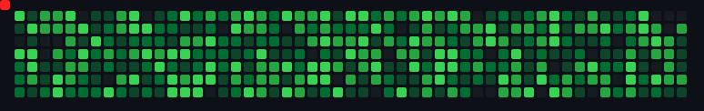
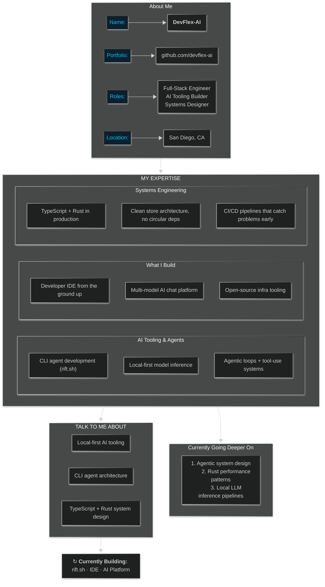

  

  

  

  
<pre><h3>Click to learn more about me</h3></pre>

---

**Full-Stack Engineer** • **AI Tooling Builder** • **Systems Designer**

[github.com/devflex-ai](https://github.com/devflex-ai) &nbsp;·&nbsp; mahriusus@gmail.com

 

  <table border="1">
    <tr>
      <td align="center"><kbd>⚙️ Systems Engineer</kbd></td>
      <td align="center"><kbd>🤖 AI Tooling</kbd></td>
      <td align="center"><kbd>🔒 Local-First</kbd></td>
      <td align="center"><kbd>🚧 Building in Public</kbd></td>
    </tr>
  </table>

 

  

 

  
  

---

<h3 align="center"><code>Core Stack</code></h3>

  <table>
    <tr>
      <td align="center" width="70">
        
         TypeScript
      </td>
      <td align="center" width="70">
        
         Rust
      </td>
      <td align="center" width="70">
        
         Python
      </td>
      <td align="center" width="70">
        
         React
      </td>
      <td align="center" width="70">
        
         Docker
      </td>
      <td align="center" width="70">
        
         GitHub
      </td>
      <td align="center" width="70">
        
         PostgreSQL
      </td>
      <td align="center" width="70">
        
         JavaScript
      </td>
    </tr>
  </table>

 

<h3 align="center"><code>Frontend & Mobile</code></h3>

  

 

<h3 align="center"><code>Backend & Data</code></h3>

  

 

<h3 align="center"><code>AI & Infra</code></h3>

  
  &nbsp;
  
  
  
  
  

---

<h3 align="center"><code>What I'm Building</code></h3>

  <table border="1">
    <tr>
      <td align="center" width="200">
        <b>rift.sh</b> 
        CLI Agent  
        <kbd>● ACTIVE</kbd>  
        Terminal-native AI agent. Privacy-first, offline-capable. Agentic loop + real filesystem access.  
        <code>TypeScript</code> <code>Rust</code> <code>local AI</code>
      </td>
      <td align="center" width="200">
        <b>IDE</b> 
        Developer Environment  
        <kbd>◌ IN DEV</kbd>  
        Ground-up IDE for AI-native workflows. Not a theme. Not an extension. A rethink.  
        <code>React</code> <code>Rust</code> <code>TypeScript</code>
      </td>
      <td align="center" width="200">
        <b>AI Platform</b> 
        Chat + Workflow Engine  
        <kbd>◌ IN DEV</kbd>  
        Multi-model AI platform. Deep internals, clean UX. Not a wrapper.  
        <code>Next.js</code> <code>Python</code> <code>PyTorch</code>
      </td>
    </tr>
  </table>

---

  

---

<h3 align="center">Connect Via</h3>

  
  &nbsp;&nbsp;&nbsp;
  

  <code>building the tools I wish existed · shipping when they're ready</code>

